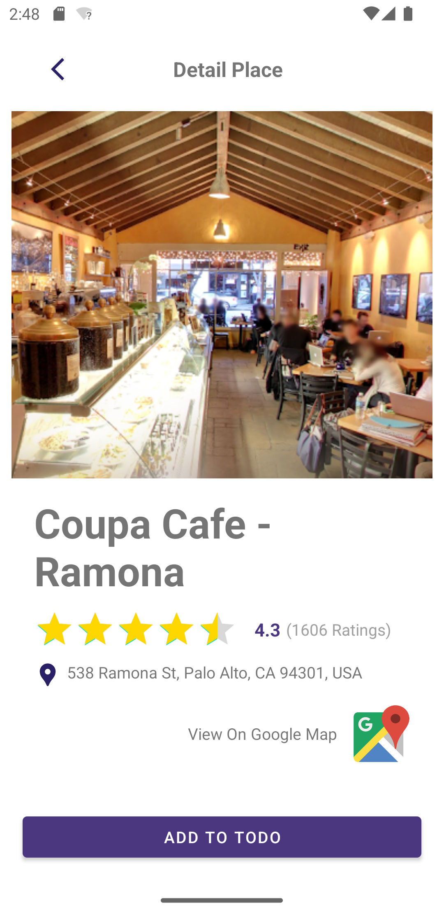
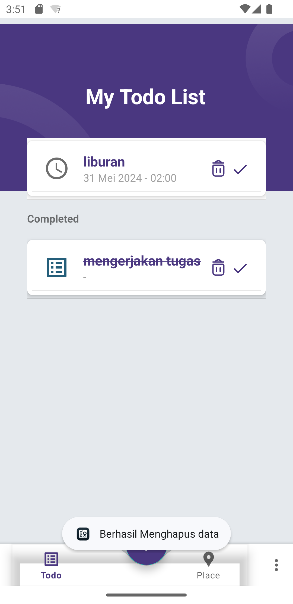

Tentu, saya akan membantu Anda membuat dokumentasi untuk proyek Todo App Anda. Berikut adalah draft `README.md` yang dapat Anda gunakan untuk repositori GitHub Anda.

---

# Todo App

Todo App adalah aplikasi Android yang dibangun dengan Kotlin untuk mengelola daftar tugas harian. Aplikasi ini juga mengimplementasikan pengambilan lokasi pengguna untuk mencari tempat sekitar berdasarkan kategori menggunakan Google Maps API.

## Author

Daniel Hasiando Sinaga - `daniel.sinaga.ds@gmail.com`

## API

https://github.com/pesuts/gmaps-geocode-nearby


## Fitur

- Menambahkan, mengedit, dan menghapus tugas
- Menampilkan daftar tugas dalam RecyclerView
- Menandai tugas sebagai selesai
- Mengambil lokasi pengguna dan mencari tempat sekitar berdasarkan kategori
- Menampilkan daftar tempat sekitar dan detail tempat
- Tampilan splash screen, login, dan sign-up
- Menggunakan SQLite untuk penyimpanan data tugas
- Menggunakan ViewModel dan LiveData untuk pengelolaan data

## Arsitektur

Aplikasi ini menggunakan arsitektur MVVM (Model-View-ViewModel) untuk pengelolaan data yang efisien dan modular.

## Instalasi

1. Clone repositori ini:
    ```sh
    git clone https://github.com/username/todo-app.git
    ```

2. Buka proyek di Android Studio.

3. Tambahkan API Key untuk Google Maps API di `AndroidManifest.xml`:
    ```xml
    <meta-data
        android:name="com.google.android.geo.API_KEY"
        android:value="YOUR_API_KEY"/>
    ```

4. Bangun dan jalankan aplikasi di emulator atau perangkat fisik.

## Struktur Proyek

- **MainActivity.kt**: Aktivitas utama aplikasi yang memuat fragment.
- **WelcomeActivity.kt**: Aktivitas untuk tampilan splash screen.
- **FragmentActivity.kt**: Aktivitas untuk menampung fragment.
- **LoginFragment.kt**: Fragment untuk tampilan login.
- **SignUpFragment.kt**: Fragment untuk tampilan sign-up.
- **WelcomeFragment.kt**: Fragment untuk tampilan selamat datang.
- **PlacesFragment.kt**: Fragment untuk menampilkan daftar tempat sekitar.
- **DetailPlaceFragment.kt**: Fragment untuk menampilkan detail tempat.
- **PlaceCategoryFragment.kt**: Fragment untuk memilih kategori tempat.
- **MainViewModel.kt**: ViewModel untuk mengelola data tugas.
- **TodoAdapter.kt**: Adapter untuk menampilkan daftar tugas dalam RecyclerView.
- **ImageSliderAdapter.kt**: Adapter untuk menampilkan slider gambar.
- **SqlTodo.kt**: Kelas untuk pengelolaan database SQLite.
- **DbContract.kt**: Kelas kontrak untuk skema database.
- **DbHelper.kt**: Kelas helper untuk pengelolaan database.
- **SqlTodoAdapter.kt**: Adapter untuk operasi CRUD pada database.
- **ResponsePlace.kt**: Data class untuk respons dari API tempat.
- **ApiConfig.kt**: Konfigurasi Retrofit untuk API.
- **ApiInterface.kt**: Interface untuk definisi endpoint API.

## Dependensi

- [Kotlin](https://kotlinlang.org/)
- [AndroidX](https://developer.android.com/jetpack/androidx)
- [Google Maps API](https://developers.google.com/maps/documentation)
- [Glide](https://github.com/bumptech/glide)
- [Retrofit](https://square.github.io/retrofit/)
- [SQLite](https://developer.android.com/training/data-storage/sqlite)

### build.gradle.kts

```kotlin
plugins {
    id("com.android.application")
    kotlin("android")
    kotlin("android.extensions")
    kotlin("kapt")
}

android {
    compileSdkVersion(30)
    defaultConfig {
        applicationId = "com.example.todoapp"
        minSdkVersion(21)
        targetSdkVersion(30)
        versionCode = 1
        versionName = "1.0"
        testInstrumentationRunner = "androidx.test.runner.AndroidJUnitRunner"
    }

    buildTypes {
        getByName("release") {
            isMinifyEnabled = false
            proguardFiles(getDefaultProguardFile("proguard-android-optimize.txt"), "proguard-rules.pro")
        }
    }
}

dependencies {
    implementation("org.jetbrains.kotlin:kotlin-stdlib:1.4.10")
    implementation("androidx.core:core-ktx:1.3.2")
    implementation("androidx.appcompat:appcompat:1.2.0")
    implementation("com.google.android.material:material:1.2.1")
    implementation("androidx.constraintlayout:constraintlayout:2.0.4")
    implementation("androidx.lifecycle:lifecycle-extensions:2.2.0")
    implementation("androidx.lifecycle:lifecycle-viewmodel-ktx:2.2.0")
    implementation("androidx.recyclerview:recyclerview:1.1.0")
    implementation("com.github.bumptech.glide:glide:4.11.0")
    kapt("com.github.bumptech.glide:compiler:4.11.0")
    testImplementation("junit:junit:4.13.1")
    androidTestImplementation("androidx.test.ext:junit:1.1.2")
    androidTestImplementation("androidx.test.espresso:espresso-core:3.3.0")
}

kapt {
    correctErrorTypes = true
}
```


## Screenshots








